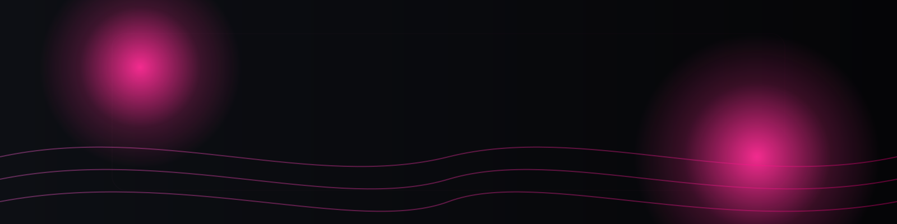
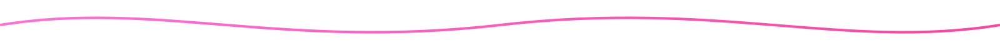

  

<h1 align="center">🖤💗 HMV — building sleek, modern web experiences</h1>

  Clean code. Fast UIs. Neon vibes.

  
  
  
  
  <!-- Add your other links (X, Telegram, Instagram, Email, Discord) here using the same color scheme -->

  

### About me

- **Beginner web developer** focused on learning fast and shipping clean, minimal apps.
- **Currently exploring** React, Next.js, Tailwind, Spring, and better UI/UX patterns.
- **I value** simplicity, performance, and that satisfying neon-on-black aesthetic.

  

### Tech stack

  
  
  
  
  
  
  
  
  
  
  
  
  
  

  

### Highlights

- 🏅 Holopin board

  

- 🐍 Snake contribution animation

  

    
  

  

### GitHub stats (black × pink)

  
  

  

  

  

### Pinned projects

<!-- Replace repo names below with your favorites -->

  
  

  

### Visitor count

  

  Made with 🖤 + 💗 — tune the pinks: <code>#FF2D95</code> / <code>#FF61D6</code>

